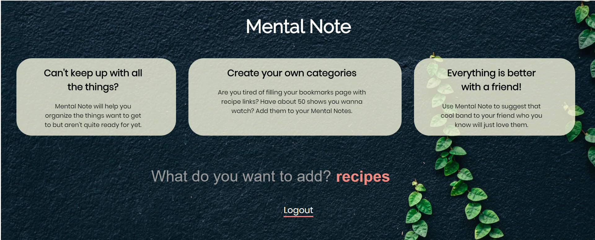
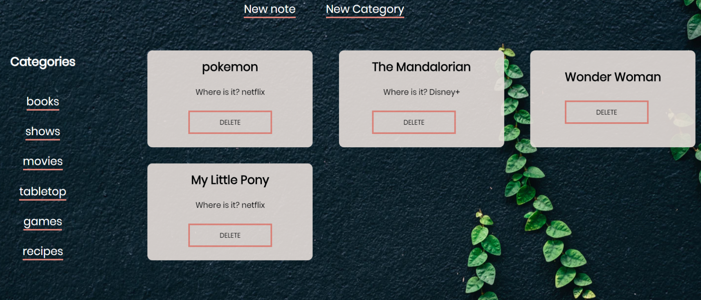
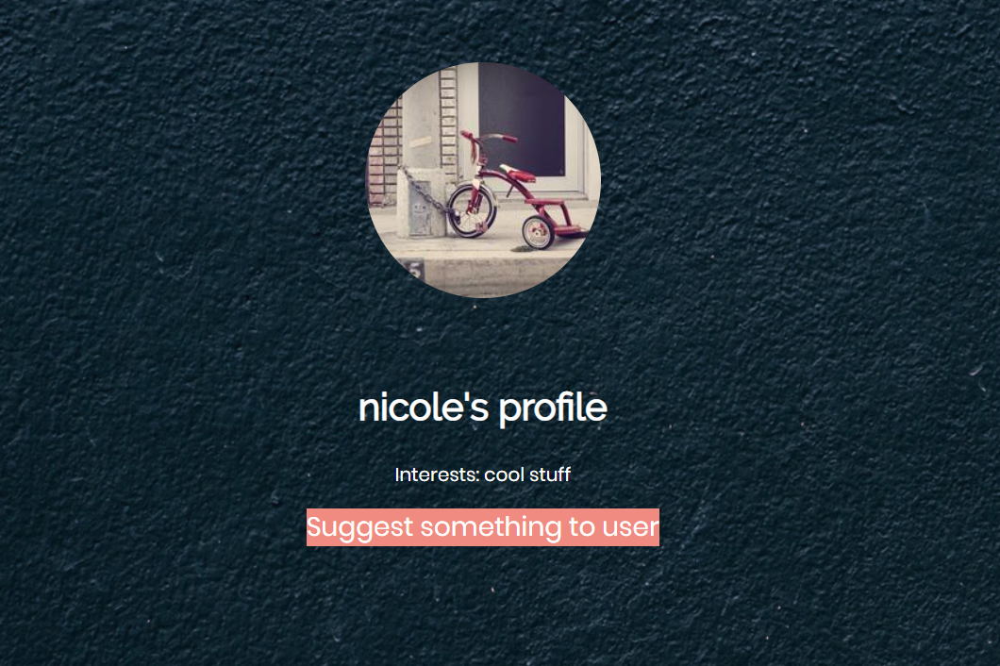

# Mental Note

A social note app.

## Motivation

I wanted to be able to keep track of different shows and movies that friends have recommended to me - this app allows me to create my own notes and allows my friends to create suggestions to me as well.

## Screenshots

Mental Note is a simple note app.

Keep track of all your notes and seperate them by category.

Recommend things to other users and have it show up on their list.

## Technology Used

Front-end:
HTML, CSS, JavaScript, React

Back-end:
Node, Express, PostgreSQL

## Demo

[Mental Note](https://mental-note.nicole919.now.sh/)

[Mental Note Server repo](https://github.com/nicole919/mental-note-server)
